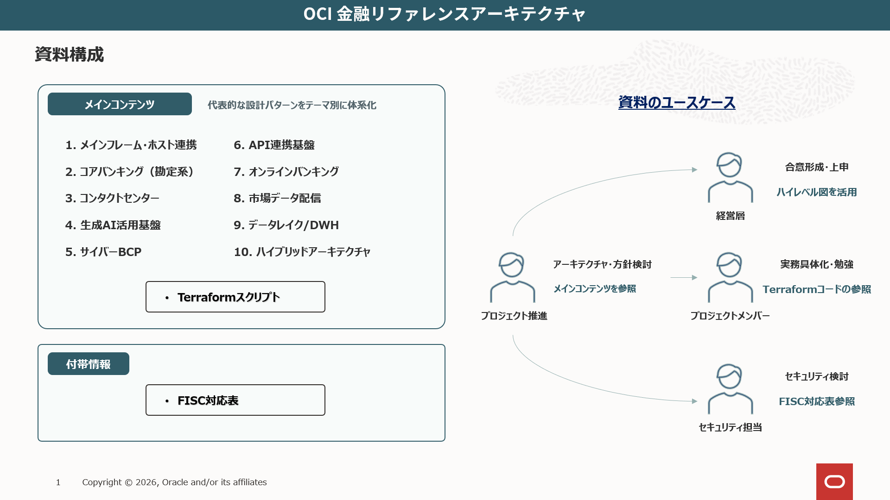
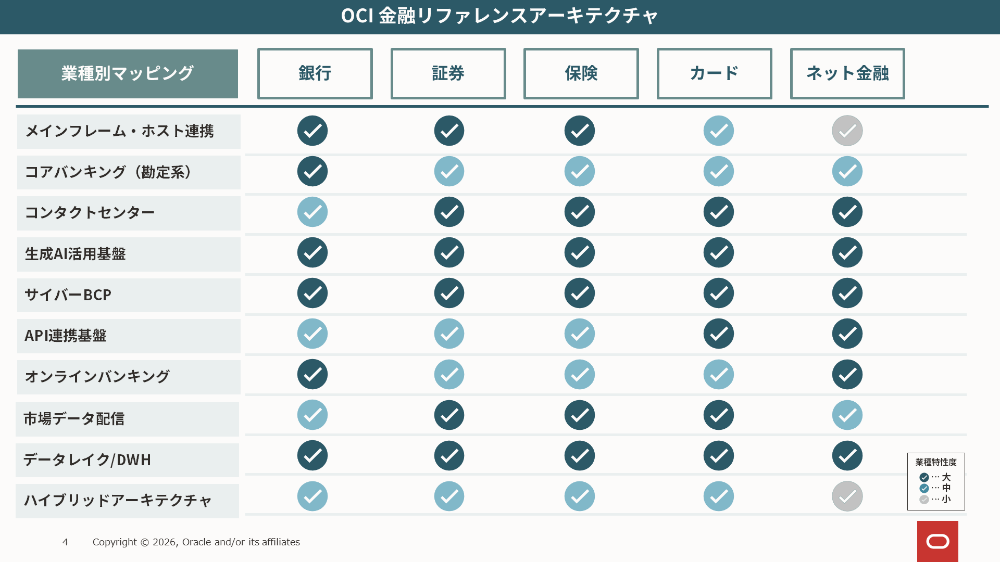
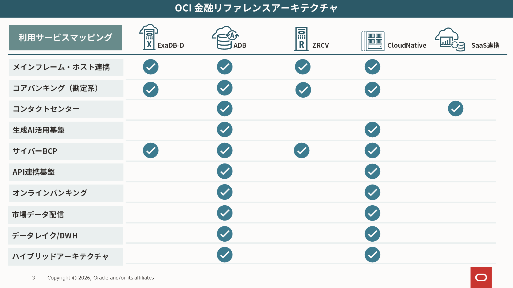

# Oracle Cloud 金融リファレンスアーキテクチャ

## はじめに
金融リファレンスアーキテクチャとは、金融機関に求められる高可用性、セキュリティ、データ保護、業務継続性などの要件を踏まえ、システム構成の検討に活用できる代表的な設計パターンを体系化したものです。   
本資料では、個別システムの構成例に加えて、全体像を把握できるハイレベル図を掲載しており、IT部門での技術検討だけでなく、非IT部門や経営層を交えた方針、投資、優先順位のディスカッションにも活用できます。
また、現場担当者様の理解促進の為Terraformのサンプルコードも掲載しております。  

## インデックス

1. メインフレーム・ホスト連携

    [01_mainframe-host-integration.md](01_mainframe-host-integration.md)

2. コアバンキング（勘定系）

    [02_core-banking.md](02_core-banking.md)

3. コンタクトセンター

    [03_contact-center.md](03_contact-center.md)

4. 生成AI活用基盤

    [04_generative-ai-platform.md](04_generative-ai-platform.md)

5. サイバーBCP

    [05_cyber-bcp.md](05_cyber-bcp.md)

6. API連携基盤

    [06_api-integration-platform.md](06_api-integration-platform.md)

7. オンラインバンキング

    [07_online-banking.md](07_online-banking.md)

8. 市場データ配信

    [08_market-data-distribution.md](08_market-data-distribution.md)

9. データレイク/DWH

    [09_data-lake-dwh.md](09_data-lake-dwh.md)

10. ハイブリッドアーキテクチャ

    [10_hybrid-architecture.md](10_hybrid-architecture.md)

11. Appendix

    [ex1_appendix.md](ex1_appendix.md)

12. 参考リンク

    [ex2_reference-links.md](ex2_reference-links.md)

## FISC対応表
FISC安全対策基準に対し寄与するOCIサービスは以下のリンクよりご確認頂けます。  
    [FISC-related-materials.md](FISC-related-materials.md)

## 免責事項
本サイトに掲載する技術情報について、正確性・完全性を保証するものではありません。  
詳細は以下のリンクをご確認ください。  
[免責事項](免責事項.md)

## プロジェクトチーム
| ロール | 部署 | 氏名 |担当|
|-----|-----|-----|-----|
|リーダー(一期)|金融Grp|杉山|発起者、本紙作成、セミナー|
|リーダー(二期)|金融Grp|黒澤|本紙作成、FISC対応、Web化|
|メンバー|金融Grp|吉澤|本紙作成|
|メンバー|金融Grp|小田|本紙作成|
|メンバー|金融Grp|西田|本紙作成、FISC対応|
|メンバー|金融Grp|戸津|本紙作成、FISC対応|
|メンバー|金融Grp|出口|レビュー、FISC対応|
|メンバー|技術支援Grp|胡|アーキテクチャ作成|
|メンバー|技術支援Grp|郭|アーキテクチャ作成、Terraform作成|
|メンバー|技術支援Grp|朱|アーキテクチャ作成|

監修 金融Grp 山浦、宮永、技術支援Grp 凯